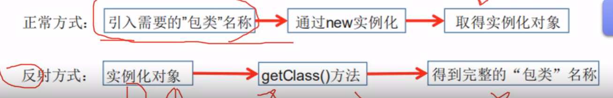
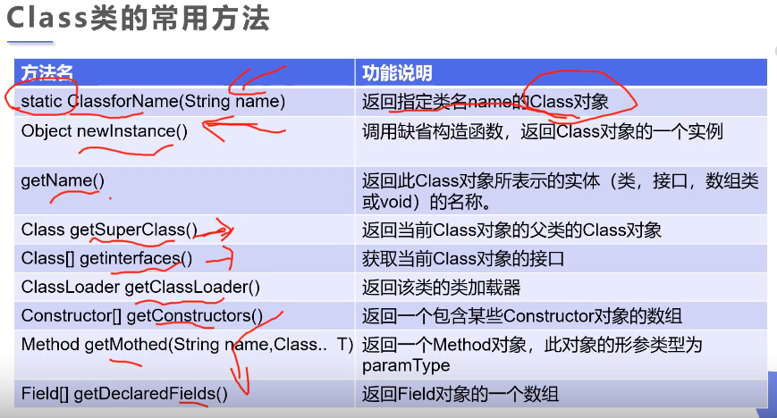
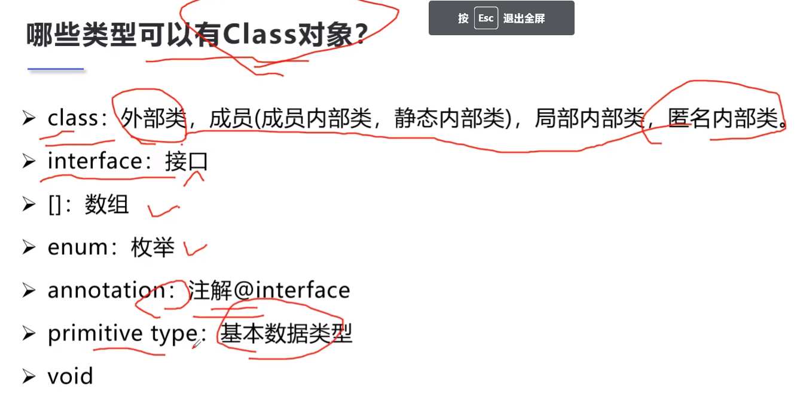
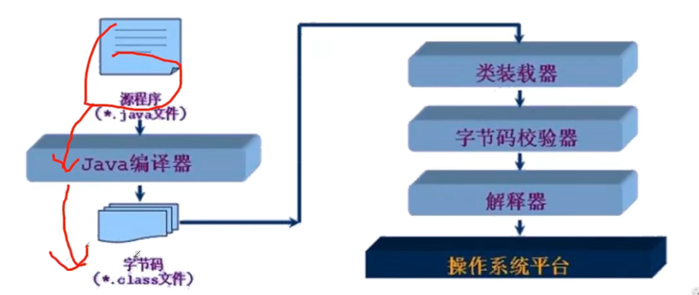
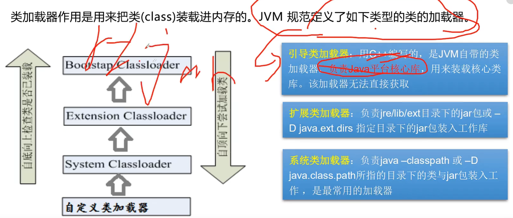
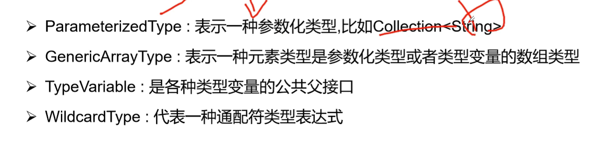
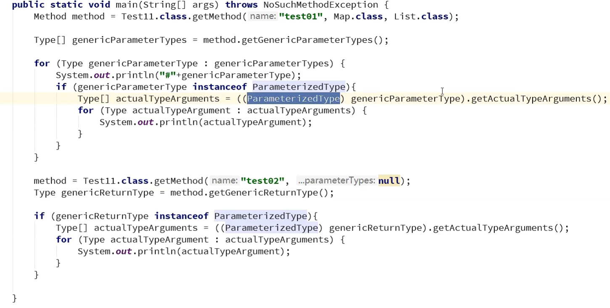
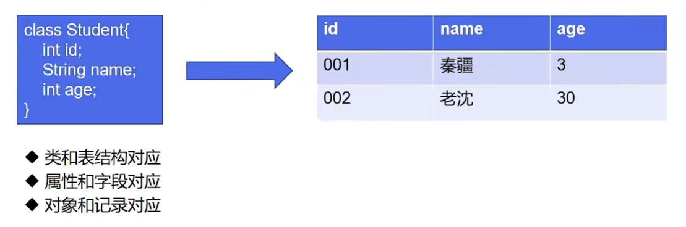

## Java注解和反射

### 注解(Annotation)

注解不仅能给人看，还能被程序读取

不是程序本身，但是可以对程序做出一些解释(这一点和注释(comment)没什么区别)，但是<mark>**可以被程序读取**</mark>

注解有检查和约束的功能

#### 注解的格式：

注解是以"@注释名"在代码中存在的，还可以添加一些参数值，例如：

`@SuppressWarnings(value="unchecked")`

#### 注解使用的位置

可以附加在package，class，method，field等上面，相当于给他们添加了额外信息 ，我们可以通过反射机制编程实现对这些元数据的访问

### 内置注解

```java
1. @Override 定义在java.lang.Override中，此注释只适用于修饰方法，表示一个方法
声明打算重写另一个超类中的方法声明
2. @Deprecated 定义在java.lang.Deprecated中，此注释用于修饰方法，属性，类，表示
不鼓励程序员使用这样的元素，通常是因为它很危险或者存在更好的选择
   调用有此注解的方法时会多一个杠
3. @SuppressWarnings 定义在java.lang.SuppressWarnings中，用来抑制编译时的警告
信息，与前两个注解不同，需要添加一个参数才能正确使用，这些参数都是定义好的，只需要选择
性使用就好，比如：
   @SuppressWarnings("all")
   @SuppressWarnings("unchecked")
   @SuppressWarnings(value = {"unchecked","deprecation")
等等
 鼠标放在某个位置会出现警告的标识框，有注解后就不会有
```

### 元注解

作用：负责解释其他注解的注解

java中定义了四个标准的meta-annotation类型，这些类型和他们所支持的类可以在

`java.lang.annotation`包中找到：

```java
@Target 用于描述注解的使用范围(即：被描述的注解可以用在什么地方)
        值可用value = ElementType.类型
@Retention 表示需要在什么级别保存该注释信息，用于描述注解的生命周期
           (SOURCE<CLASS<RUNTIME)，一般都是RUNTIME
@Document 说明该注解将包含在javadoc中
@Inherited 说明子类可以继承父类中的该注释
```

### 自定义注解

通过`@interface`来自定义注解，前面可以用元注解注解，注解需要的值(value)可以通过查看源码来赋需求的值

使用`@interface`就自动继承了`java.lang.annotation.Annotation`接口

#### 分析：

```java
@interface用于声明一个注解，格式为：public @interface 注解名{定义内容}
其中的每一个方法实际上是声明了一个配置参数
方法的名称就是参数的名称
返回值类型就是参数的类型(返回值只能是基本类型，Class,String,enum)
可以用default来声明参数的默认值
如果只有一个参数成员，一般参数名为value
注解元素必须要有值，我们定义注解元素时，经常使用空字符串，0作为默认值
```

#### 注解的参数：

`参数类型+参数名()`比如`String name();`

有默认值的注解参数`String name() default ""`如果默认值为-1，代表不存在

如果参数的名字为value，那么在给注解参数赋值时可以省略"value = ",其他名字则不行

### 反射

##### 静态语言和动态语言

+ 动态语言：是一类在运行时可以改变其结构的语言：例如新的函数、对象、甚至是代码都可以被引进，已有的函数可以被删除或是其他结构上的变化。通俗点说就是在运行时代码可以根据某些条件改变自身结构。

+ 主要动态语言：Object-C、C#、JavaScript、PHP、Python等

+ 静态语言：与动态语言想对应的，运行时结构不可变的语言就是静态语言。如Java，C，C++

+ Java不是动态语言，但Java可以称之为"准动态语言"。即Java有一定的动态性，我们可以利用反射机制获得类似动态语言的特性。Java的动态性让编程的时候更加灵活

#### Java Reflection

反射是Java被视为准动态语言的关键，反射机制允许程序在执行期借助于Reflection API获取任何类的内部信息，并能直接操作任意对象的内部属性及方法

```java
Class c = Class.forName("java.lang.String");
```

加载完类之后，在堆内存的方法区中就产生了一个Class类型的对象(一个类只有一个Class对象)，这个对象就包含了完整的类的结构信息。我们可以通过这个对象看到类的结构。这个对象就像一面镜子，透过这个镜子看到类的结构，所以形象称为反射



##### Java反射的优点和缺点

优点：可以实现动态创建对象和编译，体现出很大的灵活性   

缺点：对性能有影响。使用反射基本上是一种解释操作，我们可以告诉JVM，我们希望做什么并且满足我们的要求。这类操作总是慢于直接执行相同的操作

#### 反射相关的主要API：

```java
java.lang.Class 代表一个类
java.lang.reflect.Method 代表类的方法
java.lang.reflect.Field 代表类的成员变量
java.lang.reflect.Constructor 代表类的构造器(构造函数)
等等
```

一个类在内存中只能有一个Class对象，一个类在被加载后，类的整个结构都被封装在Class对象中

在Object类中定义的方法：`public final Class getClass()`被所有类继承，返回值类型是一个Class对象，此类是Java反射的源头

Class对象只能由系统创建

一个Class对象对应的是一个加载到JVM中的一个class文件

每个类的实例都会记得自己是由哪个Class实例生成

#### 获取Class类的实例

1. 若已知具体的类，通过类的class属性获取，该方法最为安全可靠，程序性能最高，比如`Class clazz = Person.class;`

2. 已知某个类的实例，调用该实例的getClass()方法获取Class对象，比如
   
   `Class clazz = person.getClass();`

3. 已知一个类的全类名，且该类在类路径下，可通过Class类的静态方法forName()获取，可能抛出ClassNotFoundException
   
   `Class clazz = Class.forName("demo01.Student");`

4. 内置基本数据类型可以直接用`类名.Type`

5. 还可以利用ClassLoader

#### Class类的方法

获取父类的class对象`getSuperClass()`等



### 哪些类可以有Class对象



对数组，只有类型和维度一样，那么Class对象就是同一个

### 了解：类的加载方法

当程序主动使用某个类时，如果该类还未被加载到内存中，则系统会通过如下三个步骤来对该类初始化

类的加载(Load)-->类的链接(Link)-->类的初始化(Initialize)

```java
类的加载(Load):将类的class文件读入内存，并为之创建一个java.lang.Class对象。
此过程由类加载器完成；
类的链接(Link):将类的二进制数据合并到JRE中
类的初始化(Initialize):JVM负责对类进行初始化   
```

### 类的加载与ClassLoader的理解

加载：将class文件字节码内容加载到内存中，并将这些静态数据转换成方法区的运行时数据结构，然后生成一个代表这个类的java.lang.Class对象

链接：将java类的二进制代码合并到JVM的运行状态之中的过程

    验证：确保加载的类信息符合JVM规范，没有安全方面的问题

    准备：正式为类变量(static)分配内存并设置类变量默认初始值阶段，这些内存都将在方法去中进行分配

    解析：虚拟机常量池内的符号引用(常量名)替换为直接引用(地址)的过程

初始化：

    执行类构造器`<clinit>()`方法的过程。类构造器`<clinit>()`方法是由编译期自动收集类中所有类变量的赋值动作和静态代码块中的语句合并产生的。(类构造器是构造类信息的，不是构造该类对象的构造器)

    当初始化一个类时，如果发现其父类还没有初始化，则需要先触发其父类的初始化

    虚拟机会保证一个类的`<clinit>()`方法在多线程环境中被正确加锁和同步

### 什么时候会发生类的初始化

类的主动引用(一定会发生类的初始化)

    当虚拟机启动，先初始化main方法所在的类

    new一个类的对象

    调用类的静态成员(除了final常量)和静态方法

    调用java.lang.reflect包的方法对类进行反射调用

    当初始化一个类，如果其父类没有初始化,则先会初始化它的父类

类的被动引用(不会发生类的初始化)

    当访问一个静态域时，只有真正声明这个域的类才会被初始化。如：当通过子类引用父类的静态变量，不会导致子类初始化

    通过数组定义类引用，不会触发此类的初始化

    引用常量不会触发此类的初始化(常量在链接阶段就存入调用类的常量池中了) 

### 类加载器的作用

类加载器的作用：将class文件字节码内容加载到内存中，并将这些静态数据转换成方法区的运行时数据结构，然后在堆中生成一个代表这个类的java.lang.Class对象，作为方法区中类数据的访问入口

类缓存：标准的JavaSE类加载器可以按要求查找类，但一旦某个类被加载到类加载器中，它将维持加载(缓存)一段时间。不过JVM垃圾回收机制可以回收这些Class对象





### 获取系统类的加载器

```java
ClassLoader systemClassLoader = ClassLoader.getSystemClassLoader();
```

### 双亲委派机制

如果手写一个java中rt中的包或者扩展的jar包已存在的，那就会使用已存在的包

防止同名包、类与 jdk 中的相冲突

### 获取类的运行时结构

```java
//获得类的信息，c1是一个Class对象
//获得类的名字
c1.getName();//获得包名+类名
c1.getSimpleName();//获得类名
//获得类的属性
c1.getFields();//只能获得public的属性
c1.getDeclaredFields()//获得所有的属性
//也可获得指定属性
c1.getField("name")//获得name属性(必须是public，不然会找不到抛出异常)

c1.getDeclaredField("name")//获得name属性
//获得类的方法
c1.getMethods();//获得本类及其父类的所有public方法
c1.getDeclaredMethods();//获得本类的所有方法，包括私有的等
//获得指定方法
c1.getMethod("方法名",参数类型);//比如：
c1.getMethod("getName",null);
c1.getMethod("setName",String.class);
//获得(指定的)构造器
c1.getConstructors();
c1.getConstructor(参数类型);
c1.getDeclaredConstructors();
c1.getDeclaredConstructor(参数类型);
```

### 动态创建对象执行方法

通过`newInstance();`方法构造对象，返回`Object`对象，但是如果知道是什么对象就可以进行强转

```java
//获得Class对象
Class c1 = Class.forName("com.kuang.reflection.User");
//构造一个对象
User user = (User)c1.newInstance();//本质上是调用了无参构造器
```

如果没有无参构造器就会报错

##### 通过构造器创建对象

```java
//获取构造器
Constructor constructor = c1.getDeclaredConstructor(String.class,int.class,int.class);
//通过constructor.newInstance创建对象
User user = constructor.newInstance("name","1","18");
```

##### 通过反射调用普通方法

如果要调用的方法没有参数，那么赋值为null就行

如果方法为private，那么就需要`setAccessible(true)`来调用

```java
//先有一个对象
User user = (User)c1.newInstance();
//获取一个方法
Method setName = c1.getDeclaredMethod("serName",String.class);
//通过invoke调用方法(invoke:激活的意思)
setName.invoke(user,"name2");//第一个参数是要作用的对象
```

##### 通过反射操作属性

```java
//先有一个对象
User user2 = (User)c1.newInstance();
//获取对应属性
Field name = c1.getDeclaredField("name");
//不能直接操作私有属性，需要关闭程序的安全检测，属性或方法的setAccessible(true)方法
name.setAccessible(true);//关闭权限检测，可以修改private属性
name.set(user2,"name3");
```

##### `setAccessible()`参数为false就是打开权限检测，true就是关闭权限检测，可以调用private

#### 性能

反射会降低程序的运行效率，关闭权限检测会提升一部分效率

#### 反射操作泛型

Java采用泛型擦除的机制来引入泛型，java的泛型仅仅是给编译器javac使用的，确保数据的安全性，和免去强制转换问题，但是一旦编译完成，所有和泛型相关的类型全部擦除

为了通过反射操作这些类型，java新增了`ParameterizedType`,`GenericArrayType`,`TypeVariable`和`WildcardType`几种类型来代表不能被归一到Class类型中的类型但是又和原始类型齐名的类型





#### 反射获取注解信息

ORM：Object relationship Mapping->对象关系映射



利用类和反射完成类和表结构的映射关系

先要通过反射获得注解位置上的内容，如果作用在类上就获得Class对象，如果注解到属性上就再获得field对象，再利用`getAnnotation()`获取注解，得到后再用`getValue()`获取参数信息
