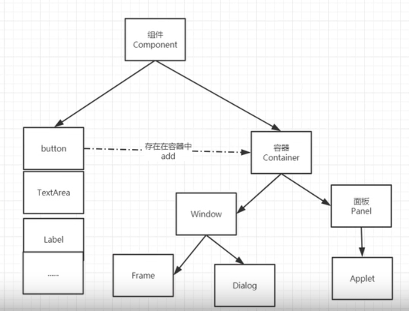

#### 简介

swing AWT

gui的核心技术，界面不美观，需要jre环境，了解MVC架构，监听

#### AWT

Swing的前身，包含很多的类和接口，GUI：图形用户界面编程

元素：窗口，按钮，文本框



+ 组件和容器

Frame 查源码 ctrl+左键，alt+7看结构

title参数就是窗口的标题

需要设置可见性(可通过对象加点.查看方法)

```java
Frame frame = new Frame("第一个窗口");
//设置可见性，默认是false,但是默认没有宽高
frame.setVisible(true);
//设置窗口大小
frame.setSize(400,400);
//设置背景颜色,需要color对象,color的构造器参数是rgb/rgba，或者Color.常量
frame.setBackground(color);
//弹出的位置，默认最中间(0,0)为左上角
frame.setLocation(200,200);
//设置大小固定，默认为true
frame.setResizable(false);
```

`setBounds()`方法可以同时设置弹出位置和宽高

默认窗口无法关闭

##### 面板panel

panel设置坐标是相对于frame的

通过frame.add添加面板到panel

监听事件，监听窗口关闭事件System.exit(0)

```java
frame.addWindowListener(WindowListener对象);
//如果直接new，需要重写里面的所有方法，所以可以new一个子类，重写其中一个方法
//WindowAdapter
```

#### 布局管理器

frame.setLayout()可以设置布局

+ 流式布局
  
  参数中new一个FlowLayout

+ 东西南北中
  
  BorderLayout
  
  

+ 表格布局Grid
  
  GridLayout
  
  

java.pack()是java的函数，会取最优的位置

##### 事件监听

按钮添加事件


`e.getActionCommand()`得到按钮的一些信息，如果没有设置，就获得按钮的label

###### 输入框(TextField)监听事件

getSource()方法，获得一些信息，返回一个对象(Object)，可以转型为任何类

TextField的构造函数参数代表最大位数


`textField.setEchoChar('*')`设置字符替换

+ 标签
  
  Label，构造函数参数表示显示的内容

组合>继承，可以将要用的属性抽出，在监听的类中传入当前窗口对象

也可以使用内部类，内部类可以访问外部类

##### 画笔Paint

调用对应的方法，可以设置颜色和画相应的图

##### 鼠标监听

##### 窗口监听

##### 键盘监听

#### Swing

##### JFrame

`jf.getContentPane()`获得容器

##### 弹窗JDialog

默认有关闭操作
