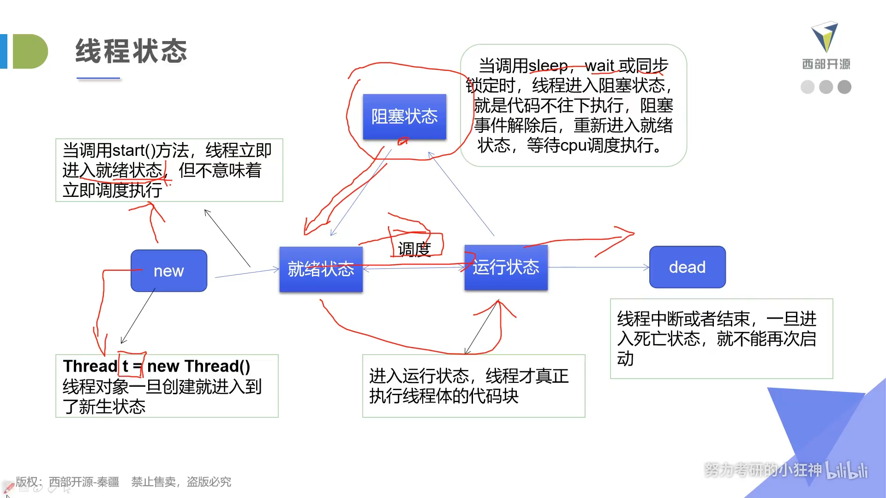

### 多线程

java.Thread

多线程创建方式：

+ Thread class(继承Thread类)

+ Runnable接口(实现Runnable接口)

+ Callable接口(实现Callable接口)

#### 多任务

现实中有很多同时做多件事情的例子，都是看起来是多个任务同时做，但是本质上依旧是大脑在同一时间做了一件事

#### 多线程

普通方法调用和多线程：


#### 程序.进程.线程

进程(process)，线程(thread)

通常一个进程中可以包含若干个线程。线程是cpu调度和执行的单位

很多多线程是模拟出来的，真正的多线程是指有多个cpu，即多核，如服务器。如果是模拟出来的多线程，即在一个cpu下，同一个时间点，cpu只能执行一个代码，因为切换很快，所以有同时执行的错觉

### 线程的创建

#### 继承Thread类

+ 自定义线程类继承Thread类

+ 重写run()方法，编写线程执行体

+ 创建线程对象，调用start()方法启动线程

线程开启不一定立即执行，由cpu调度

commons-io包内的FileUtils的CopyURLToFile方法

#### 实现Runnable接口

+ 定义自定义类实现Runnable接口

+ 实现run()方法，编写线程执行体

+ 创建线程对象，调用start()方法启动线程


比较：


推荐实现runnable接口，避免单继承局限性

获得线程名：`Thread.currentThread.getName()`

#### 并发问题

买火车票例子(多个线程操作同一个资源)

发现问题：多个线程操作同一个资源的情况下，线程不安全，资源紊乱

案例：龟兔赛跑

```java
public class Race implements Runnable{
    private String winner;

    @Override
    public void run() {
        for (int i = 0; i <= 1000; i++) {

            if(isGameOver(i)){
           break;
              }
            System.out.println(Thread.currentThread().getName()+"-->跑了"+i+"步");

        }
    }

    private boolean isGameOver(int steps){
        if(winner!=null){

            return true;
        }else if(steps >= 1000){
            winner = Thread.currentThread().getName();
            System.out.println(Thread.currentThread().getName()+"赢了");
            return true;
        }
        return false;
    }

    public static void main(String[] args) {
        Race race = new Race();

        new Thread(race,"Tom").start();
        new Thread(race,"Jerry").start();
    }
}
```

#### 实现Callable接口

+ 实现Callable接口，需要返回值类型

+ 重写call方法，需要抛出异常

+ 创建目标对象

+ 创建执行服务：`ExecutorService ser = Executors.newFixedThreadPool(1);`

+ 提交执行：`Future<Boolean> result1 = ser.submit(t1); `

+ 获取结果：`boolean r1 = result1.get();`

+ 关闭服务：`ser.shutdownNow();`


Callable好处：

有返回值，可以抛出异常


#### 静态代理模式

真实对象和代理对象都要实现同一个接口，代理对象要代理真实角色(传进参数)，再调用真实目标的方法

真实对象：


代理对象：


调用：


好处：

代理对象可以做真实对象做不了的事，真实对象专注做自己的事情

#### 多线程和静态代理

底部的实现原理就是静态代理


#### 线程的五大状态

创建状态(new)，就绪状态(start)，阻塞状态，运行状态，死亡状态(正常执行完)




线程方法

+ setPriority(int newPriority) 更改线程优先级

+ static void sleep(long millis) 在指定的毫秒数内让正在执行的线程休眠

+ void join() 等待该线程终止

+ static void yield() 暂停当前正在执行的线程对象，并执行其他线程

+ void interrupt() 中断线程，别用这个方式

+ boolean isAlive() 测试线程是否处于活动状态

###### 停止线程

不推荐使用JDK提供的stop(),destroy()方法【已废弃】

推荐线程自己停止下来

建议使用一个标志位进行终止变量，当flag=false,则终止线程运行


###### 线程休眠

+ sleep(时间) 指定当前线程阻塞的毫秒数

+ sleep存在异常InterruptedException;

+ sleep时间达到后线程进入就绪状态

+ sleep可以模拟网络延时，倒计时等

+ 每一个对象都有一个锁，sleep不会释放锁；

模拟网络延时：放大问题的发生性，可以排查线程的安全性


##### 线程礼让

+ 让当前正在执行的线程暂停，但不阻塞

+ 将线程从运行状态转为就绪状态

+ 让CPU重新调度，礼让不一定成功

`Thread.yield()`

##### 线程强制执行

+ join合并线程，待此线程执行完成后，再执行其他线程，其他线程阻塞

+ 类似插队


##### 线程状态观测

+ Thread.State

线程状态，线程可以处于以下状态之一：

+ NEW 尚未启动的线程

+ RUNNABLE 在JAVA虚拟机中执行的线程

+ BLOCKED 被阻塞等待监视器锁定的线程

+ WAITING 正在等待另一个线程执行特定动作的线程

+ TIMED_WAITING 正在等待另一个线程执行动作达到指定等待时间的线程

+ TERMINATED 已退出的线程

观察线程：

`Thread.State state = thread.getState();`

一个线程不能start()两次

##### 线程的优先级

+ Java提供一个线程调度器来监控程序中启动后进入就绪状态的所有线程，线程调度器按照优先级决定应该调度哪个线程来执行

+ 线程的优先级用数字表示，范围从1~10
  
  + Thread.MIN_PRIORITY = 1;
  
  + Thread.MAX_PRIORITY = 10;
  
  + Thread.NORM_PRIORITY = 5;

+ 使用以下方式改变或获取优先级
  
  + getPriority(),setPriority(int xxx)

线程优先级高不一定先执行，还要看cpu的调度

默认优先级为5，优先级的设定建议在start()调度前

##### 守护线程(daemon)

+ 线程分为用户线程和守护线程

+ 虚拟机必须确保用户线程执行完毕

+ 虚拟机不用等待守护线程执行完毕

+ 如 后台记录操作日志，监控内存，垃圾回收等


用`setDaemon()`方法来设置守护线程，参数为true时为守护线程，false为用户线程，默认为用户线程

#### 线程同步

多个线程操作同一个资源

###### 并发

同一个对象被多个线程同时操作

###### 线程同步

+ 现实生活中，我们遇到"同一个资源，多个人都想使用"的场景，最天然的解决办法就是排队

+ 处理多线程问题时，多个线程访问同一个对象，并且某些线程还想修改这个对象，这时候我们就需要线程同步。线程同步其实就是一种等待机制，多个需要同时访问此对象的线程进入这个对象的等待池形成队列，等待前面线程使用完毕，下一个线程再使用
  
  队列和锁(形成条件)

+ 由于同一进程的多个进程共享同一块存储空间，再带来方便的同时也带来冲突问题，为了保证数据在方法中被访问时的正确性，在访问时加入锁机制(synchronized),当一个线程获得对象的排它锁，独占资源，其他线程必须等待，使用后释放锁即可。存在以下问题：
  
  + 一个线程持有锁会导致其他需要此锁的线程挂起；
  
  + 在多线程竞争下，加锁，释放锁会导致比较多的上下文切换和调度延时，引起性能问题；
  
  + 如果一个优先级高的线程等待一个优先级第的线程释放锁，会导致优先级倒置，引起性能问题

##### 不安全案例

买票:不安全，有负数 未排队买

取钱：不安全 同时操作同一个账户，余额为负数

多线程添加list：不安全，会造成数据丢失

##### 同步方法及同步块

由于我们可以通过private关键字来保证数据对象只能被方法访问，所以我们只需要针对方法提出一套机制，这套机制就是synchronized关键字，它包括两种用法：synchronized方法和synchronized块

`同步方法：public synchronized void method(int args){}`

synchronized方法控制对"对象"的访问，每个对象对应一把锁，每个synchronized方法都必须获得调用该方法的对象的锁才能执行，否则线程会阻塞，方法一旦执行，就独占该锁，直到该方法返回才释放锁，后面被阻塞的线程才能获得这个锁，继续执行

`缺陷:将一个大的方法声明为synchronized将会影响效率`

方法里面需要修改的内容才需要锁，锁的太多浪费资源(只读代码不需要锁)

同步方法**默认锁的是this**

##### 同步块

+ 同步块：`synchronized(Obj){}`

+ Obj称之为同步监视器
  
  + **Obj可以是任何对象**，但是推荐使用共享资源作为同步监视器
  
  + 同步方法中无需指定同步监视器，因为同步方法的同步监视器就是this，也就是这个对象本身，或者是class

+ 同步监视器的执行过程
  
  1. 第一个线程访问，锁定同步监视器，执行其中的代码
  
  2. 第二个线程访问，发现同步监视器被锁定，无法访问
  
  3. 第一个线程访问完毕，解锁同步监视器
  
  4. 第二个线程访问，发现同步监视器没有锁，然后锁定并访问

锁的对象是变化的量(增删改)

##### CopyOnWriteArrayList

包：`java.util.concurrent.CopyOnWriteArrayList`(并发包)

这个list是线程安全的

##### 死锁

多个线程各自占有一些共享资源，并且互相等待其他线程占有的资源才能运行，而导致两个或者多个线程都在等待对方释放资源，都停止执行的情形。某一个同步块同时拥有"两个以上对象的锁"时，就可能会发生"死锁"的问题

即**多个线程互相抱着对方需要的资源，然后形成僵持**


这样会造成死锁

修改makeup方法避免死锁，将两个锁拆开


##### 死锁避免的方法

+ 产生死锁的四个必要条件
  
  + 互斥条件：一个资源每次只能被一个进程使用
  
  + 请求与保持条件：一个进程因请求资源而阻塞时，对已获得的资源抱持不放
  
  + 不剥夺条件： 进程已获得的资源，在未使用完之前，不能强行剥夺
  
  + 循环等待条件：若干进程之间形成一种头尾相接的循环等待资源关系

我们只要想办法破其中的任意一个条件或多个条件就可以避免死锁发生

##### Lock(锁)

+ jdk5.0开始，提供了更强大的线程同步机制--通过显式定义同步锁对象来实现同步。同步锁使用Lock对象充当

+ java.util.concurrent.locks.Lock接口是控制多个线程对共享资源访问的工具，锁提供了对共享资源的独占访问，每次只能有一个进程对象Lock对象加锁，线程开始访问共享资源之前应先获得Lock对象

+ ReentrantLock(可重入锁)类实现了Lock，它拥有与synchronized相同的并发性和内存语义，在实现线程安全的控制中，比较常用的是ReentrantLock,可以显式加锁，释放锁


建议将锁对象设置为私有常量，lock方法调用建议放在try/finally语句中


synchronized和Lock对比

+ Lock是显式锁(手动开启和关闭锁，别忘记关闭锁)synchronized是隐式锁出了作用域自动释放

+ Lock只有代码块锁，synchronized有代码块锁和方法锁

+ 使用Lock锁，JVM将花费较少的时间来调度线程，性能更好。并且具有更多的扩展性(提供更多的子类)

+ 使用优先顺序：
  
  + Lock>同步代码块(已经进入了方法体，分配了相应的资源)>同步方法(在方法体之外)
