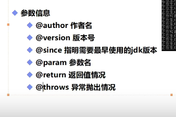
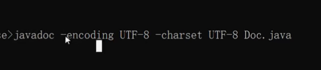
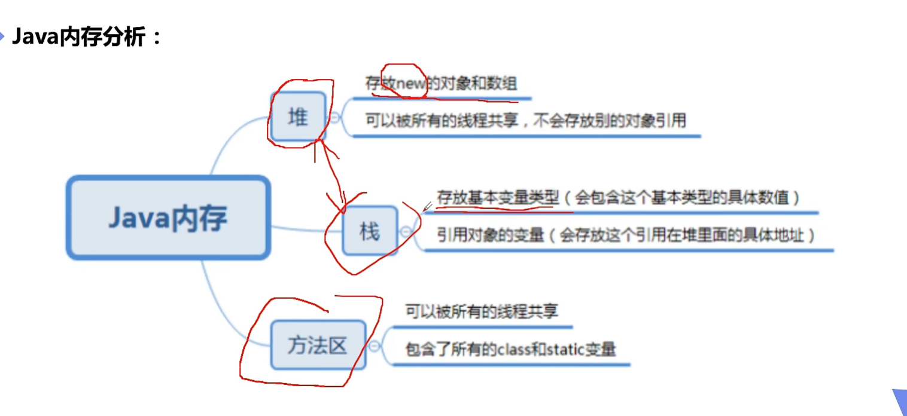
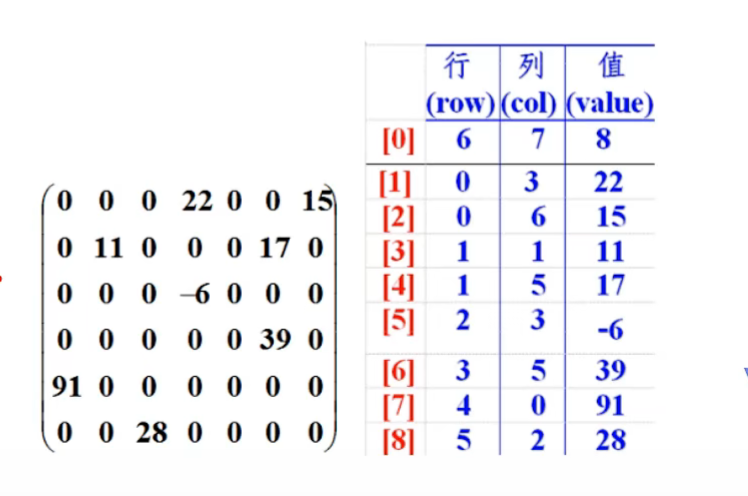

配合文档注释使用，比如：

```java
/**
*注释
*/
```



在dos命令中可生成相



### Scanner

Scanner用完要close

### Java 内存分析



### Arrays类

可以通过查询jdk帮助手册或者直接查看源码的structure

数组可以直接调用这个类的静态方法

### 稀疏数组

当一个数组内大部分元素为0或者为同一个值时，可以使用稀疏数组保存

稀疏数组处理方法：

```java
将数组有几行几列记录下来，有多少个不同的值

把具有不同值的元素的行列及值记录在一个小规模数组中以减少程序规模
```



### error和exception的区别

error是程序错误，一般都是灾难性的致命错误，是程序无法控制的，一般出现这种错误jvm会选择终止线程

exception通常都是可以被程序处理的

### 接口

接口就是比抽象类更抽象的

接口只有规范，自己无法写方法

接口就是一种规范，定义的是一组规则

接口中的所有方法定义都是抽象的，而且默认都是public abstract

接口都需要有实现类，一般是impl结尾

接口中定义的属性都是默认常量public static final
