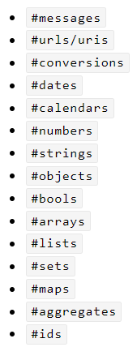

### Thymeleaf入门

web开发离不开动态页面的开发，目前来说最主流的方案是Thymeleaf

Thymeleaf是一个模板框架，它可以支持多种格式的内容动态渲染非常强大，而且天然是与HTML相融合的

Spring选择Thymeleaf作为默认模板方案

#### 模板


我们通过模板引擎，可以把Java对象数据+模板页面动态的渲染出一个真实的HTML页面

如果name变成其他歌单的名称，那么页面渲染后也自然就会变成新的歌单名称

模板引擎在所有的Web编程语言里都有类似的方案。所以掌握一个框架之后再去学习其他的就会容易很多

机制：简单来说就是**数据+模板+引擎**渲染出真实的页面

#### 如何初始化Thymeleaf

###### 添加Maven依赖

```xml
<dependency>
  <groupId>org.springframework.boot</groupId>
  <artifactId>spring-boot-starter-thymeleaf</artifactId>
</dependency>
```

###### 数据传递

只需要在方法参数里引入一个Model对象，就可以通过这个Model对象传递数据到页面中

导入Model类：

```java
import org.springframework.ui.Model;
```

比如：

```java
@Controller
public class SongListControl {

  @Autowired
  private SongListService songListService;

  @RequestMapping("/songlist")
  public String index(@RequestParam("id")String id,Model model){

    SongList songList = songListService.get(id);
    //传递歌单对象到模板当中
    //第一个 songList 是模板中使用的变量名
    // 第二个 songList 是当前的对象实例
    model.addAttribute("songList",songList);

    return "songList";
  }
}
```

###### 模板文件

Spring MVC中对模板文件是有固定位置的，放置在`src/main/resources/templates`

所以上面的`return "songList";`其实会去查找`src/main/resources/template/songList.html`文件，系统会自动匹配后缀所以不需要写成`return "songList.html"`

Thymeleaf模板文件是以html作为文件格式的所以也最容易学习

文件内容：

```html
<!DOCTYPE html>
<html lang="en" xmlns:th="http://www.thymeleaf.org">
  <head>
    <meta charset="UTF-8" />
    <meta name="viewport" content="width=device-width, initial-scale=1.0" />
    <meta http-equiv="X-UA-Compatible" content="ie=edge" />
    <link rel="stylesheet" href="/css/songList.css" />
    <title>豆瓣歌单</title>
  </head>
  <body>
    <h1 th:text="${songList.name}"></h1>
  </body>
</html>
```

模板文件后缀虽然也是.html大部分内容跟HTML文件很像，但是因为放置在`src/main/resources/templates`目录下，而且里面可以写变量`th:text = "${...}"`

所以其实不是html文件，而且thymeleaf模板

注意：`xmlns:th="[http://www.thymeleaf.org](http://www.thymeleaf.org)`的作用是，在写代码时，让软件识别到thymeleaf语法

只要工程的`src/main/resources/templates`下面放置了文件就代表需要使用Thyemeleaf，这些文件就是模板

放置在`src/main/resources/static`目录下的就不是模板，是静态文件

#### Thymeleaf变量

Thymeleaf模板语法非常强大，相当于一门动态编程语言，所以很多语言的特性都支持，比如变量，循环，条件

#### 模板变量

由于Thymeleaf是完全兼容HTML的，所以步破坏HTML结构，Thymeleaf采用了自定义HTML属性的方式来生成动态内容

`th"text`这个属性就是Thymeleaf自定义的HTML标签属性，`th`是Thymeleaf的缩写，所以如果看到`th:`开头的标签属性，那么久代表使用的是Thymeleaf语法

`th:text`语法的作用就是会动态替换掉html标签的内部内容，比如

```html
<span th:text="${msg}">Hello</span>
```

执行结果就是用msg变量值替换了span标签内的hello字符串，比如msg变量值是`你好`渲染结果就是

```html
<span>你好</span>
```

如何读取变量，上面的th属性内的`${msg}`这个语法就是表示获取模板中的变量msg，这个语法是固定的

一般情况下模板的变量都是会存放在模板上下文中，所以我们如果想要调用变量，就需要先设置变量到模板上下文中去，就像`model.addAttribute("songList",songList);`就可以完成上下文变量的设置，比如：

```java
import org.springframework.ui.Model;

@Controller
public class DemoControl {

  @RequestMapping("/demo")
  public String index(Model model){

    SongList songList = new SongList();
    songList.setId("0001");
    songList.setName("爱你一万年");

    model.addAttribute("sl",songList);
    return "demo";
  }
}
```

第一个参数设置的就是上下文变量(变量名是可以随便定义的)

第二个参数设置的是变量值(可以是任意对象)

##### 对象变量

模板语言还可以支持复杂的对象输出，可以使用`.`把属性调用出来

```java
import org.springframework.ui.Model;

@Controller
public class DemoControl {

  @RequestMapping("/demo")
  public String index(Model model){

    SongList songList = new SongList();
    songList.setId("0001");
    songList.setName("爱你一万年");

    model.addAttribute("sl",songList);
    return "demo";
  }
}
```

在模板中通过`th:text = "s1.name"`,`th:text="sl.id"`分别得到name，id的值

如果对象包含对象，还可以用`.`一直点出来，前提是这个对象是POJO类

#### Thymeleaf循环语句

在模板中，for循环和变量的组合是最常见的，比如歌单的歌曲列表，如果想显示出来就需要借助循环

Thymeleaf的for循环也是使用标签属性来完成的，`th:each`代表的就是循环语句，比如

```html
<ul th:each="song : ${songs}">
  <li th:text="${song.name}">歌曲名称</li>
</ul>
```

`${songs}`是从模板上下文中获取songs这个变量

`song`是`${songs`变量遍历后的每一个对象

`${song.name}`就可以读取遍历中歌曲名称了

java代码：

```java
  @RequestMapping("/demo")
  public String index(Model model){
    List<Song> songs = new ArrayList<>();

    Song song = new Song();
    song.setId("0001");
    song.setName("朋友");
    songs.add(song);

    song = new Song();
    song.setId("0002");
    song.setName("夜空中最亮的星");
    songs.add(song);

    model.addAttribute("songs",songs);
    return "demo";
  }
```

Thymeleaf除了支持List数据类型，还可以支持数组、Map等集合类

##### 打印列表的索引值

经常能看到有些列表需要显示当前行数，就需要借助`th:each`的另一种写法

```html
<ul th:each="song,it: ${songs}">
  <li>
    <span th:text="${it.count}"></span>
    <span th:text="${song.name}"></span>
  </li>
</ul>
```

多出来一个`it`，这个是作为可选参数出行，如果定义了就可以通过这个it对象来获取更多关于统计的需求，具体参数：

+ `it.index`当前迭代对象的index(从0开始计算),如果想从0开始显示行数就用这个

+ `it.count`当前迭代读写的index(从1开始计算)

+ `it.size`被迭代对象的大小，如果想获取列表长度，就用这个

+ `it.current`当前迭代变量，等同上面的song

+ `it.even/odd`布尔值，当前循环是否是偶数/奇数(从0开始计算)

+ `it.first`布尔值，当前循环是否是第一个

+ `it.last`布尔值，当前循环是否是最后一个

模板中的布尔值需要结合条件语句来处理

如果对象有多级，也可以嵌套循环    

#### Thymeleaf表达式

Thymeleaf表达式对于动态数据处理更为方便

主要用于两种场景

+ 字符串处理

+ 数据转化

##### 字符串处理

很多网站上都会看到视频时间的显示效果：`00:00/45:00`,在Thymeleaf中这种显示就需要借助`+`就可以完成字符串拼接

```html
<span th:text="'00:00/'+${totalTime}"></span>
```

需要注意的是`00:00/`我们用`'`包围住，作用在于把这个文本变成Java字符串，两个字符串可以使用`+`拼接成新的字符串

Control代码：

```java
  @RequestMapping("/demo")
  public String index(Model model){

    String totalTime = "45:00";

    model.addAttribute("totalTime",totalTime);
    return "demo";
  }
```

如果不用''包围就会出现错误内容，错误内容中会提示模板编译错误

##### 字符串拼接优化

我们使用上面的代码还可以用`|`围住字符串，这样就不需要再文字后面附加`'...'+'...'`，比如：

```html
<span th:text="|00:00/${totalTime}|"></span>
```

##### 数据转化

Thymeleaf默认集成了大量的工具类可以方便的进行数据转化，一般使用最多的是`dates`

如果想处理`LocalDate和LocalDateTime`可以再pom.xml中添加依赖

```xml
<dependency>
  <groupId>org.thymeleaf.extras</groupId>
  <artifactId>thymeleaf-extras-java8time</artifactId>
  <version>3.0.4.RELEASE</version>
</dependency>
```

会自动添加一个新的工具类`temporals`

工具类的运用和变量不同，变量使用的是`${变量名`,工具类使用的是`#工具类`

###### dates/temporals

dates和temporals支持的方法是一样的，只是支持的类型不同，dates支持的是Date类，temporals支持的是LocalDate和LocalDateTime

一般用来处理日期类型到字符串的转化，比如显示`年月日`

```html
<p th:text="${#dates.format(dateVar, 'yyyy-MM-dd')}"></p>
<p th:text="${#dates.format(dateVar, 'yyyy年MM月dd日')}"></p>
```

如果显示`年月日时分秒`

```html
<p th:text="${#dates.format(dateVar, 'yyyy-MM-dd HH:mm:ss')}"></p>
<p th:text="${#dates.format(dateVar, 'yyyy年MM月dd日 HH时mm分ss秒')}"></p>
```

Java代码：

```java
  @RequestMapping("/demo")
  public String index(Model model){

    Date dateVar = new Date();

    model.addAttribute("dateVar",dateVar);
    return "demo";
  }
```

如果日期类型是`LocalDate/LocalDateTime`就把`#dates`换成`#temporals`

###### strings

`#strings`也是我们使用比较多的方法，支持字符串的数据处理，比如

+ `${#strings.toUpperCase(name)}`字符串改成全大写

+ `${#strings.toLowerCase(name)}`字符串改成全小写

+ `${#strings.arrayJoin(array,',')}`把字符串数组合并成一个字符串，并以`,`连接

+ `${#strings.arraySplit(str,',')}`把字符串分隔成一个数组，并以`,`作为分隔符

+ `${#strings.trim(str)}`把字符串去空格，左右空格都会去掉

+ `${#strings.length(str)}`得到字符串长度，也支持获取集合类的长度

+ `${#strings.equals(str1,str2)}`比较两个字符串是否相等

+ `${#strings.equalsIgnoreCase(str1,str2)}`忽略大小写后比较两个字符串是否相等

##### 完整的内置对象



[thymeleaf 工具和内置对象 - 简书](https://www.jianshu.com/p/d8bc610c4400)

[官方帮助文档](https://www.thymeleaf.org/apidocs/thymeleaf/3.0.11.RELEASE/org/thymeleaf/expression/Arrays.html)

##### 内联表达式

有时候会直接把变量写在HTML中，比如：

```html
<span>Hello [[${msg}]]</span>
```

`[[变量]]`这种格式就是内联表达式，支持直接在HTML中调用变量

```java
  @RequestMapping("/demo")
  public String index(Model model){
    String msg = "丫丫";

    model.addAttribute("msg",msg);
    return "demo";
  }
```

执行日期函数

```html
<p>[[ ${#dates.format(dateVar, 'yyyy-MM-dd')} ]]</p>
<p>[[${#dates.format(dateVar, 'yyyy年MM月dd日')}]]</p>

<p>[[${#dates.format(dateVar, 'yyyy-MM-dd HH:mm:ss')}]]</p>
<p>[[${#dates.format(dateVar, 'yyyy年MM月dd日 HH时mm分ss秒')}]]</p>
```

#### Thymeleaf条件语句

Thymeleaf也支持if/else能力，也是`th:`开头的属性，用`th:if`if表达式的值是true的情况下就会执行渲染

```html
<span th:if="${user.sex == 'male'}">男</span>
```

还可以使用`th:unless`代表的是否定条件，这个语句和if是相反的，代表的是sex不是male的情况才会渲染

```html
<span th:unless="${user.sex == 'male'}">女</span>
```

th:if条件判断除了boolean外，还认为如下表达式为true：

+ 值非空

+ 非0数字

+ 值为字符串但是不是false，off，no

+ 值不是boolean值，数字，character或字符串

##### 用户列表

结合循环语句显示用户列表

```html
<div>
  <li th:each="user : ${users}">
    <span>[[${user.name}]]</span>
    <span th:if="${user.sex == 'male'}">男</span>
    <span th:unless="${user.sex == 'male'}">女</span>
  </li>
</div>
```

配置java数据

```java
  @RequestMapping("/demo")
  public String index(Model model){

    List<User> users = new ArrayList<>();

    User user = new User();
    user.setId("0001");
    user.setName("范闲");
    user.setSex("male");
    users.add(user);

    user = new User();
    user.setId("0002");
    user.setName("司理理");
    user.setSex("female");
    users.add(user);

    user = new User();
    user.setId("0003");
    user.setName("庆帝");
    user.setSex("male");
    users.add(user);

    user = new User();
    user.setId("0004");
    user.setName("海棠朵朵");
    user.setSex("female");
    users.add(user);

    model.addAttribute("users",users);
    return "demo";
  }
```

##### strings逻辑判断

很多时候会借助`#strings`这个内置对象来做逻辑判断和数据处理，比如：

+ isEmpty 检查字符串变量是否为空(或者为null),在检查之前会先执行trim()操作，去掉空格
  
  `${#strings.isEmpty(name)}`
  
  数组也能用isEmpty
  
  `${#strings.arrayIsEmpty(name)}`
  
  集合类也能用
  
  `${#strings.listIsEmpty(name)}`

+ contains 检查字符串变量是否包含片段
  
  `${#strings.contains(name,'abc')}`

+ 其他常用的判断语法
  
  + `${#strings.containIgnoreCase(name,'abc')}`先忽略大小写字母，然后判断是否包含指定字符串
  
  + `${#strings.startWith(name,'abc')}`判断字符串是不是以abc开头
  
  + `${#strings.endWith(name,'abc')}`判断字符串是不是以abc结束的

+ 以及之前的`#strings`内的函数
